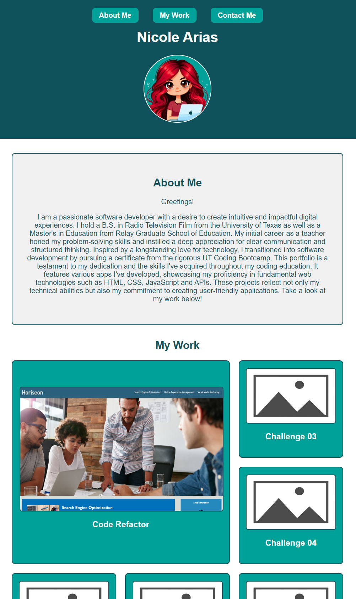

# Web Development Portfolio

## Description

The purpose of this challenge was to use the skills learned in Module 2 of Bootcamp to create a portfolio for my previous and future work. In this project, I put my HTML and CSS skills to test. I structured my webpage with HTML, adding sections for About Me, My Work, and Contact Me. In the HTML, I used class selectors and the id elements to pinpoint where I wanted different styling options. In the CSS, I coded my styling choices according to what I liked! I made sure that the container for my Challenge 01 project was bigger to highlight the project. I also made different choices in color, font, font-size, borders, justification, etc. in order to organize my content into a structure that made readability and accessibility better for the user that will view my page. This challenge was especially important to me because once I pursue a career in coding, I will have a place to display my deployed projects for future employers to see, so there's a very useful real-world application to it.

## Usage

In order to access the deployed website, click the following link: [https://nearias3.github.io/Web-Development-Portfolio/]

## Credits

Useful information about coding, including tutorials and guides, were provided by the UT Bootcamp GitLab: [https://git.bootcampcontent.com/University-of-Texas-at-Austin/UTA-VIRT-FSF-PT-05-2024-U-LOLC/].

The profile picture avatar was taken from Bing's AI tool: [https://bing.com].

HEX code combinations were tested for readability on Image Color Picker: [https://imagecolorpicker.com/].

I frequently referred to Mozilla's developer tool blogs for help identifying the correct code and syntax: [https://developer.mozilla.org/en].

The placeholder images for Challenges 03-09 and Project 1 were taken from Adobestock: [https://stock.adobe.com].

## License

Please refer to the license in the repo.